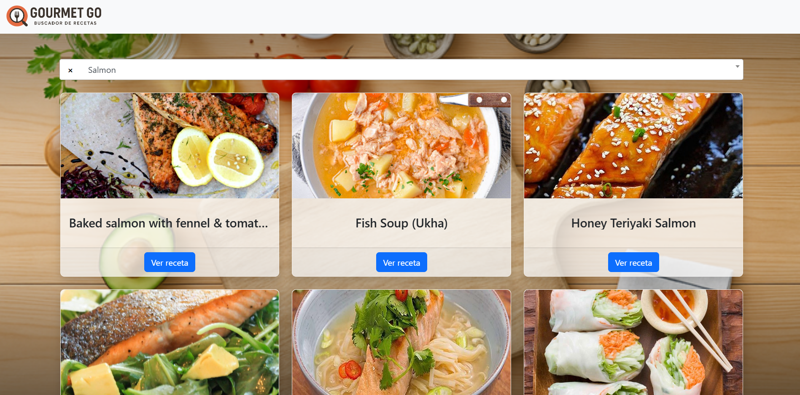

# Gourmet Go — Buscador de Recetas



Una aplicación web de página única (SPA) que permite buscar recetas de cocina por ingrediente. El usuario elige un ingrediente desde un buscador con autocompletado y la app muestra tarjetas con recetas que lo utilizan. Cada tarjeta tiene un efecto de volteo (flip) al hacer clic en "Ver receta", revelando los ingredientes y las instrucciones de preparación.

---

## Vista previa

La interfaz muestra un fondo culinario con una barra de búsqueda central. Los resultados aparecen como tarjetas en cuadrícula (1, 2 o 3 columnas según el tamaño de pantalla). Al voltear una tarjeta se pueden leer los ingredientes exactos y los pasos de preparación directamente desde la API.

---

## Características

- **Búsqueda por ingrediente** con autocompletado enriquecido: cada opción del desplegable muestra la imagen y una descripción del ingrediente.
- **Tarjetas con efecto flip en 3D** — la cara frontal muestra la foto y el nombre del plato; la cara trasera, la lista de ingredientes y la preparación.
- **Carga diferida de detalles**: los ingredientes y la preparación solo se obtienen de la API en el momento en que el usuario voltea la tarjeta por primera vez, evitando peticiones innecesarias.
- **Diseño responsivo** basado en Bootstrap 5: las tarjetas se reorganizan automáticamente en pantallas pequeñas, medianas y grandes.
- **Manejo de errores**: si la API no responde o no hay resultados para el ingrediente elegido, se muestra un mensaje amigable al usuario.
- **Año dinámico** en el pie de página (nunca queda desactualizado).

---

## Tecnologías utilizadas

| Tecnología | Versión | Rol |
|---|---|---|
| HTML5 | — | Estructura y template declarativo (`<template>`) |
| CSS3 | — | Estilos personalizados, flip 3D con CSS puro |
| JavaScript (ES2022+) | — | Lógica de la aplicación, clases, async/await |
| [Bootstrap](https://getbootstrap.com/) | 5.3.8 | Sistema de grilla, componentes de UI |
| [Select2](https://select2.org/) | 4.1.0-rc.0 | Dropdown con búsqueda y resultados enriquecidos |
| [jQuery](https://jquery.com/) | 3.7.1 | Requerido por Select2 |
| [TheMealDB API](https://www.themealdb.com/api.php) | v1 (free) | Fuente de datos: ingredientes, recetas y detalles |

---

## Estructura del proyecto

```
Recetas_V2/
├── index.html          # Página principal y template HTML de las tarjetas
├── assets/
│   ├── css/
│   │   └── style.css   # Estilos: fondo, navbar, flip cards, Select2
│   └── js/
│       └── app.js      # Lógica completa: clase Receta, llamadas a la API
└── README.md
```

---

## Cómo funciona

### Inicialización

Al cargar la página, la app hace una petición a la API para obtener la lista completa de ingredientes disponibles y los carga en el dropdown de Select2. Cada opción muestra la imagen del ingrediente y su descripción.

### Búsqueda

Cuando el usuario selecciona un ingrediente, se realiza una segunda petición para obtener todas las recetas que lo contienen. Por cada receta devuelta se instancia un objeto `Receta` y se renderiza una tarjeta clonando el `<template>` del HTML.

### Detalle de receta (lazy load)

La tarjeta tiene una cara frontal (foto + nombre) y una cara trasera (ingredientes + preparación). El volteo se controla con un `<input type="checkbox">` oculto y CSS puro (`rotateY(180deg)`), sin JavaScript adicional. Cuando el usuario activa el volteo por primera vez, el evento `change` del checkbox dispara `cargarDetalles()`, que consulta la API con el ID de esa receta y rellena la cara trasera con los datos reales.

### Clase `Receta`

```
Receta
├── constructor({ idMeal, strMeal, strMealThumb })
├── cargarDetalles()   → async, consulta API_DETAILS, extrae hasta 20 ingredientes/medidas
└── toHTML()           → clona el template, vincula el checkbox, retorna el nodo DOM
```

---

## API utilizada

Se consume la versión gratuita de **TheMealDB** (sin clave API):

| Endpoint | Uso |
|---|---|
| `list.php?i=list` | Lista completa de ingredientes |
| `filter.php?i={ingrediente}` | Recetas que contienen ese ingrediente |
| `lookup.php?i={id}` | Detalle completo de una receta |

---

## Cómo ejecutar el proyecto

No requiere instalación ni servidor de backend. Solo abre el archivo `index.html` en cualquier navegador moderno.

```bash
# Opción 1: abrir directamente
# Haz doble clic en index.html

# Opción 2: con Live Server (VS Code)
# Clic derecho sobre index.html → "Open with Live Server"
```

> El proyecto consume la API pública de TheMealDB, por lo que necesita conexión a internet para funcionar.

---

## Decisiones de diseño destacadas

- **`<template>` nativo del DOM**: en lugar de construir HTML como strings, se usa el elemento `<template>` para clonar tarjetas de forma segura y eficiente.
- **Flip card sin JavaScript**: el efecto de volteo en 3D se logra exclusivamente con CSS usando el truco del `checkbox` oculto (`:checked + .flip-card`), lo que simplifica el código JS y mejora el rendimiento.
- **Lazy load de detalles**: se evita saturar la API con peticiones masivas. Los detalles de cada receta solo se cargan cuando el usuario los solicita explícitamente.
- **CSS anidado moderno**: el archivo de estilos usa la sintaxis de anidamiento CSS nativa (sin preprocesadores), aprovechando el soporte actual de los navegadores.

---

## Posibles mejoras futuras

- Añadir un spinner de carga mientras se espera la respuesta de la API.
- Implementar un sistema de favoritos usando `localStorage`.
- Agregar filtros adicionales (categoría, área de origen).
- Internacionalización (i18n) para mostrar instrucciones en español cuando estén disponibles.
- Paginación o scroll infinito para ingredientes con muchas recetas.

---

## Autor

Elvis Andrade
